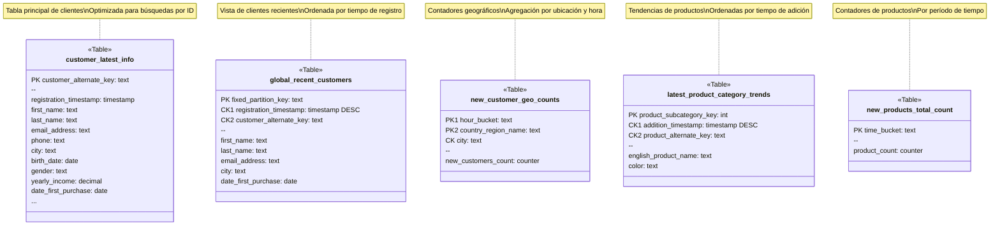

# Soluciones NoSQL para Análisis de Datos en Tiempo Real

Este proyecto implementa una solución de análisis de datos en tiempo real utilizando Apache Cassandra como base de datos NoSQL, diseñada para complementar entornos analíticos tradicionales con capacidades de procesamiento en tiempo real.

## 📝 Descripción

El sistema proporciona una plataforma de análisis de datos en tiempo real que permite:
- Ingestión continua de datos desde sistemas transaccionales
- Almacenamiento optimizado para consultas rápidas
- Visualización en tiempo real de métricas clave
- Análisis instantáneo de patrones y tendencias

## 📊 Modelo de Datos

El modelo de datos está optimizado para consultas en tiempo real, utilizando las características de Cassandra para lograr máximo rendimiento:




### Características del Modelo

1. **Customer Latest Info**
   - Tabla principal de clientes con todos los detalles
   - Clave primaria simple para búsquedas por ID de cliente
   - Optimizada para consultas de perfil completo

2. **Global Recent Customers**
   - Diseñada para listar los últimos clientes registrados
   - Usa `fixed_partition_key` para evitar hotspots
   - Ordenamiento por timestamp descendente para últimos registros

3. **New Customer Geo Counts**
   - Contadores por ubicación y hora
   - Clave compuesta para distribución geográfica eficiente
   - Permite agregaciones por país y ciudad

4. **Product Category Trends**
   - Seguimiento de productos por categoría
   - Ordenamiento temporal descendente para últimas adiciones
   - Optimizada para consultas de tendencias

5. **Products Count by Time**
   - Contadores simples por período de tiempo
   - Soporta diferentes granularidades (5min/hora/día)
   - Ideal para métricas de velocidad de ingesta

### Consideraciones de Diseño

- Uso de claves compuestas para distribución eficiente
- Contadores para métricas agregadas
- Ordenamiento por timestamp para consultas temporales
- Desnormalización estratégica para rendimiento
- Particionamiento optimizado para escrituras distribuidas

## 🚀 Características

- **Ingestión de Datos en Tiempo Real**: Integración con RabbitMQ para procesamiento de eventos
- **Almacenamiento Optimizado**: Modelos de datos específicamente diseñados para consultas rápidas en Cassandra
- **API REST**: Endpoints para acceder a datos en tiempo real
- **Dashboard Interactivo**: Visualización en tiempo real de métricas clave del negocio
- **Escalabilidad**: Arquitectura diseñada para manejar grandes volúmenes de datos

## 🛠️ Tecnologías Utilizadas

- **Base de Datos**: Apache Cassandra
- **Message Broker**: RabbitMQ
- **Backend**: Python (Flask)
- **Frontend**: HTML5, JavaScript, Bootstrap
- **API**: REST

## 📋 Requisitos Previos

- Python 3.8+
- Docker Desktop
- [Data Integration Platform](https://github.com/vfd003-ual/data-integration-platform) (para el sistema de colas)

## ⚙️ Configuración

1. **Clonar el repositorio**
   ```powershell
   git clone <url-del-repositorio>
   cd real-time-data-analytics-cassandra
   ```

2. **Crear entorno virtual e instalar dependencias**
   ```powershell
   python -m venv venv
   .\venv\Scripts\Activate
   
   # Instalar dependencias principales
   pip install cassandra-driver pika Flask Flask-Cors python-dotenv
   # O usar el archivo de requisitos
   pip install -r requirements.txt
   ```

3. **Configurar variables de entorno**
   ```powershell
   Copy-Item .env.example .env
   # Editar .env con tus configuraciones
   ```

4. **Iniciar Cassandra con Docker**
   ```powershell
   # Crear y ejecutar el contenedor de Cassandra con persistencia
   docker run -d --name my-cassandra-db -v ./cassandra-data:/var/lib/cassandra -p 9042:9042 cassandra:latest

   # Esperar a que Cassandra esté lista (1-2 minutos)
   # Conectarse al contenedor para configurar la base de datos
   docker exec -it my-cassandra-db cqlsh
   ```

5. **Configurar la base de datos**
   ```sql
   -- Verificar keyspaces disponibles
   DESCRIBE KEYSPACES;

   -- Crear nuevo keyspace
   CREATE KEYSPACE realtime_analytics_ks 
   WITH replication = {
     'class': 'SimpleStrategy',
     'replication_factor': 1
   };

   -- Usar el keyspace
   USE realtime_analytics_ks;

   -- Crear tablas necesarias
   CREATE TABLE customer_latest_info (
       customer_alternate_key text PRIMARY KEY,
       registration_timestamp timestamp,
       first_name text,
       last_name text,
       email_address text,
       phone text,
       address_line1 text,
       address_line2 text,
       city text,
       state_province_code text,
       postal_code text,
       title text,
       middle_name text,
       name_style int,
       birth_date date,
       marital_status text,
       suffix text,
       gender text,
       yearly_income decimal,
       total_children int,
       number_children_at_home int,
       english_education text,
       spanish_education text,
       french_education text,
       english_occupation text,
       spanish_occupation text,
       french_occupation text,
       house_owner_flag int,
       number_cars_owned int,
       date_first_purchase date,
       commute_distance text
   );

   CREATE TABLE new_customer_geo_counts_by_hour (
       hour_bucket text,
       country_region_name text,
       city text,
       new_customers_count counter,
       PRIMARY KEY ((hour_bucket, country_region_name), city)
   );

   CREATE TABLE new_products_total_count_by_time (
       time_bucket text PRIMARY KEY,
       product_count counter
   );

   CREATE TABLE latest_product_category_trends (
       product_subcategory_key int,
       addition_timestamp timestamp,
       product_alternate_key text,
       english_product_name text,
       color text,
       PRIMARY KEY ((product_subcategory_key), addition_timestamp, product_alternate_key)
   ) WITH CLUSTERING ORDER BY (addition_timestamp DESC);

   CREATE TABLE global_recent_customers (
       fixed_partition_key text,
       registration_timestamp timestamp,
       customer_alternate_key text,
       first_name text,
       last_name text,
       email_address text,
       city text,
       date_first_purchase date,
       PRIMARY KEY (fixed_partition_key, registration_timestamp, customer_alternate_key)
   ) WITH CLUSTERING ORDER BY (registration_timestamp DESC);

   -- Verificar tablas creadas
   DESCRIBE TABLES;

   -- Salir de cqlsh
   EXIT;
   ```

6. **Configurar sistema de colas**
   Seguir las instrucciones de instalación del [Data Integration Platform](https://github.com/vfd003-ual/data-integration-platform) para configurar RabbitMQ.

## 🚀 Ejecución

1. **Iniciar el API**
   ```powershell
   python realtime_api.py
   ```

2. **Iniciar el subscriber de eventos**
   ```powershell
   python cassandra_subscriber.py
   ```

3. **Acceder al dashboard**
   ```
   http://localhost:5000
   ```

## 📊 Estructura del Proyecto

```
├── realtime_api.py          # API REST
├── cassandra_subscriber.py  # Consumidor de eventos
├── requirements.txt         # Dependencias Python
├── .env.example            # Plantilla de configuración
├── static/                 # Archivos estáticos
│   ├── index.html         # Dashboard principal
│   ├── css/               # Estilos
│   └── js/               # Scripts del frontend
```

## 📈 Métricas Disponibles

- Conteo de productos nuevos (5min/hora/día)
- Distribución geográfica de clientes
- Tendencias por categoría de producto
- Registro de clientes en tiempo real

## ✨ Agradecimientos

Este proyecto forma parte de un Trabajo de Fin de Grado en Ingeniería Informática, desarrollado para demostrar las capacidades de las soluciones NoSQL en el análisis de datos en tiempo real.

- El trabajo completo se encuentra disponible en: [data-integration-platform](https://github.com/vfd003-ual/data-integration-platform)
- La implementación de Cassandra está basada en el [Seminario de Apache Cassandra](https://ualmtorres.github.io/SeminarioCassandra) de la Universidad de Almería
